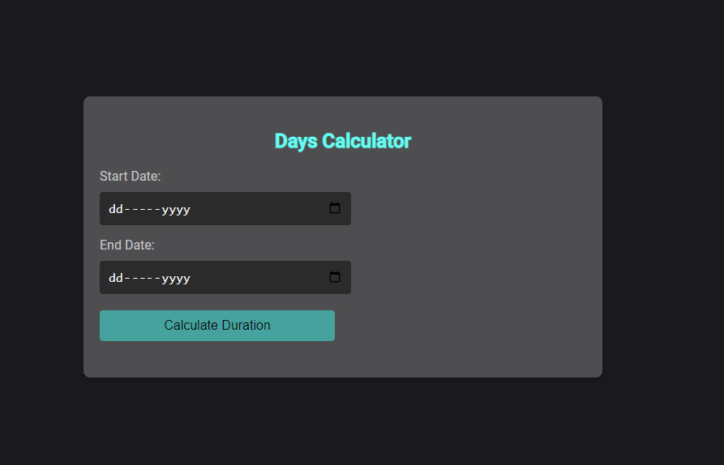

# Date Duration Calculator

The Date Duration Calculator is a simple, user-friendly web tool that calculates the number of days between two selected dates. It provides the duration in days, months, and other alternative time units, offering a clear and concise way to measure time intervals for planning and scheduling purposes.

## Features

- **Date Selection**: Users can pick start and end dates using a calendar interface.
- **Duration Calculation**: Calculates the total duration between the chosen dates in days, excluding the end date.
- **Alternative Time Units**: Displays the duration in alternative units like seconds, minutes, hours, weeks, and months.
- **Responsive Design**: Works well on both desktop and mobile browsers.

## Usage

To use the Date Duration Calculator, simply open `date-calculator.html` in your web browser. Select the start and end dates using the calendar icons next to the input fields, then click the "Calculate Duration" button. The results will be displayed immediately below the button.

## Technologies

- HTML5
- CSS3
- JavaScript

## Preview

*Note: The actual appearance may vary depending on the browser and operating system.*

## How to Contribute

Contributions are welcome! If you'd like to contribute, please follow these steps:

1. Fork the repository.
2. Create a new branch (`git checkout -b feature/AmazingFeature`).
3. Commit your changes (`git commit -m 'Add some AmazingFeature'`).
4. Push to the branch (`git push origin feature/AmazingFeature`).
5. Open a Pull Request.

## License

Distributed under the MIT License. See `LICENSE` for more information.

## Contact

## Author

**Aviad Ofek**
